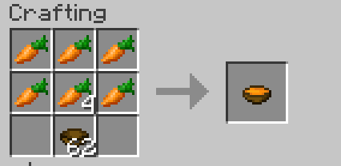

# myDatapack
An experimental Minecraft datapack for me to learn different ways of doing things and stuff. 

## Features
- Carrot Soup

- Carrot Cake 

## Installation
1.  Navigate to your Minecraft world folder.
2.  Open the `datapacks` folder.
3.  Place the `myDatapack` folder inside.
4.  Navigate to `resourcepacks` folder.
5.  Add the `myResourcepack` folder inside.
6.  Enable the `myResourcepack` in game settings.
7.  Run `/reload` in-game or restart your world.

## Authors
[@sadbunnygit](https://github.com/sadbunnygit)

## Sources Used during Creation
#### *not direct pages but the overall source*
- [https://minecraft.wiki/]
- [https://datapack.wiki/]
